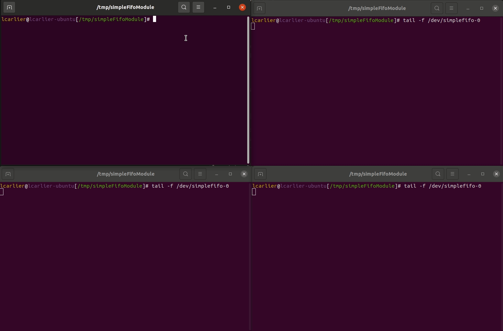

# Simple FIFO kernel driver

This repository shows how it is possible to test a kernel module using
[EasyMock](https://github.com/lcarlier/EasyMock/).

The kernel module implements a very simple multi readers/writers fifo. 



This readme serves as a documentation
on how unit tests are implemented to validate a Linux kernel driver.

The first section goes over the general issues of unit testing a Linux kernel driver. The second section
explains how building the unit test is achieved. The third section explains the different
unit test that are implemented.

# Table of content
- [Simple FIFO kernel driver](#simple-fifo-kernel-driver)
- [Table of content](#table-of-content)
- [Problems with unit testing a Linux kernel driver](#problems-with-unit-testing-a-linux-kernel-driver)
- [Creating the unit test build](#creating-the-unit-test-build)
    * [Generating the mocks](#generating-the-mocks)
    * [Compiling the Linux kernel module file](#compiling-the-linux-kernel-module-file)
    * [Integrating everything using Catch2](#integrating-everything-using-catch2)
- [Time to unit test](#time-to-unit-test)
    * [Testing module init](#testing-module-init)
        + [Positive scenario](#positive-scenario)
        + [Negative scenario](#negative-scenario)
    * [Testing opening the fifo](#testing-opening-the-fifo)
        + [Positive scenario](#positive-scenario-1)
        + [Negative scenario](#negative-scenario-1)
- [Conclusion](#conclusion)

# Problems with unit testing a Linux kernel driver
The theory of unit testing is to be able to write tests that are small and independent of their environment.
The unit tests should:
* be fast to compile and execute
* test the smallest possible unit of your system (e.g. a function)
* not exercise multiple components

This last bullet is very important. A unit test shouldn't rely on the internal implementation of the other components
it is using. In fact, the unit test shouldn't even compile the external dependencies. This is certainly a problem
when thinking of unit testing a Linux kernel module. A Linux kernel module relies on a lot of different components
(e.g. memory allocation, mutexes, ...) and it may seem impossible to only test the logic of a Linux kernel driver
without all its dependencies. Also, Linux kernel drivers run in kernel space, so it is natural to think
that tests can only run in kernel space.

One solution to break dependencies is to write manually some stubs or dummies of the dependencies.
This can become a very tedious task considering the amount of different dependencies Linux kernel driver uses.

Another solution, which is used in this repository, is to make use of a tool to generate mocks automatically. Those
mocks, ideally, can be configured to return sensible values to the logic to be tested whenever they are called.
This is where [EasyMock](https://github.com/lcarlier/EasyMock/) comes into the picture.
[EasyMock](https://github.com/lcarlier/EasyMock/) allows programmers to generate mocks out of header files. By first
configuring the mocks and then call the function to be tested, it is possible to create tests cases of positives, but
also negatives scenarios. By compiling the code of the Linux kernel driver against mocks, it is possible to create
a user space test application which runs the logic of the Linux kernel driver.

The rest of this article will illustrate how [EasyMock](https://github.com/lcarlier/EasyMock/) can be used to 
build efficient and simple tests that can be compiled and debugged from the comfort of your favourite IDE.

# Creating the unit test build

## Generating the mocks

When compiling a kernel modules, tons of compile flags are given to GCC.
Those compile flags includes: extra include paths, declaring preprocessor variables (e.g `-D__KERNEL__ -DMODULE`),
etc... Because [EasyMock](https://github.com/lcarlier/EasyMock/) uses internally `libclang` to parse the header
file it is mocking, it needs to be aware of all of those flags. Otherwise
[EasyMock](https://github.com/lcarlier/EasyMock/) will not be able to find the header files that the file to
be mocked includes, or some functions that are guarded with `#ifdef`. This problem is solved by running
the following bash command

```shell
$ make -n -C /lib/modules/5.11.0-38-generic/build M=/home/lcarlier/Projects/c/simpleFifoKernelDriver/simpleFifoModule CC=clang-12 V=1 VERBOSE=1 modules | sed -n -e 's/^.*clang-12 \(.*\) -c -o.*$/\1/p'
-Wp,-MMD,/home/lcarlier/Projects/c/simpleFifoKernelDriver/simpleFifoModule/.simpleFifo.o.d  -nostdinc -isystem /usr/lib/llvm-12/lib/clang/12.0.0/include  -I./arch/x86/include -I./arch/x86/include/generated  -I./include -I./arch/x86/include/uapi -I./arch/x86/include/generated/uapi -I./include/uapi -I./include/generated/uapi -include ./include/linux/kconfig.h -Iubuntu/include  -include ./include/linux/compiler_types.h -D__KERNEL__ -fmacro-prefix-map=./= -Wall -Wundef -Werror=strict-prototypes -Wno-trigraphs -fno-strict-aliasing -fno-common -fshort-wchar -fno-PIE -Werror=implicit-function-declaration -Werror=implicit-int -Werror=return-type -Wno-format-security -std=gnu89 -no-integrated-as -Werror=unknown-warning-option -mno-sse -mno-mmx -mno-sse2 -mno-3dnow -mno-avx -fcf-protection=none -m64 -mno-80387 -mstack-alignment=8 -mtune=generic -mno-red-zone -mcmodel=kernel -DCONFIG_X86_X32_ABI -Wno-sign-compare -fno-asynchronous-unwind-tables -mretpoline-external-thunk -fno-jump-tables -fno-delete-null-pointer-checks -Wno-frame-address -Wno-address-of-packed-member -O2 -Wframe-larger-than=1024 -fstack-protector-strong -Wimplicit-fallthrough -Wno-unused-const-variable -fno-omit-frame-pointer -fno-optimize-sibling-calls -gsplit-dwarf -gdwarf-4 -pg -mfentry -DCC_USING_FENTRY -Wdeclaration-after-statement -Wvla -Wno-pointer-sign -Wno-array-bounds -fno-strict-overflow -fno-stack-check -Werror=date-time -Werror=incompatible-pointer-types  -DMODULE -Werror -Wall -Wextra -Wno-unused-parameter -DKBUILD_BASENAME='\''"simpleFifo"'\'' -DKBUILD_MODNAME='\''"simpleFifo"'\''
```

The `-n` parameters runs make in dry mode and `CC=clang-12` makes sure that flags compatible to Clang are given.
The `sed` command extracts the actual flags given to Clang.

Putting it all together within a CMakeList.txt file, the following will generate a mock using
[EasyMock](https://github.com/lcarlier/EasyMock/) whenever it is required by a target that depends on it.

**test/CMakeLists.txt**
```cmake
execute_process(COMMAND bash -c "make -n -C /lib/modules/${KERNEL_VERSION}/build M=${PROJECT_SOURCE_DIR}/simpleFifoModule CC=clang-12 V=1 VERBOSE=1 modules | sed -n -e 's/^.*clang-12 \\(.*\\) -c -o.*$/\\1/p'"
        WORKING_DIRECTORY ${PROJECT_SOURCE_DIR}/simpleFifoModule
        ERROR_QUIET
        COMMAND_ECHO STDOUT
        OUTPUT_VARIABLE KERNEL_COMPILE_COMMAND_ARGS
        OUTPUT_STRIP_TRAILING_WHITESPACE)

# ...
# Finally prepend the common arguments
set(KERNEL_COMPILE_COMMAND_ARGS --generate-types -o ${CMAKE_CURRENT_BINARY_DIR} --cwd /lib/modules/${KERNEL_VERSION}/build ${KERNEL_COMPILE_COMMAND_ARGS})

add_custom_command(OUTPUT easyMock_cdev.c linux/cdev.h
        COMMAND EasyMockGenerate ARGS -i /lib/modules/${KERNEL_VERSION}/build/include/linux/cdev.h
        --mock-only cdev_alloc
        --mock-only cdev_init
        --mock-only cdev_add
        --mock-only cdev_del
        --mock-only class_unregister
        --generate-attribute format
        ${KERNEL_COMPILE_COMMAND_ARGS}
        COMMAND ${CMAKE_COMMAND} -E create_symlink ../easyMock_cdev.h linux/cdev.h
        DEPENDS
        /lib/modules/${KERNEL_VERSION}/build/include/linux/cdev.h
        EasyMockGenerate
        )
```

Here are some explanations over important parameters given to [EasyMock](https://github.com/lcarlier/EasyMock/).
* `--generate-types`: makes sure that the mock that is generated can be use autonomously without the need
of using the original header. It also allows the generation of the mock of `inline` functions. Such function can't
generally be mocked because the code is defined inline, hence can't be replaced by a mocked version.
* `--mock-only`: greatly speedup the mock generation as the tool will focus only on parsing and generating the list
of functions passed via that parameter.

## Compiling the Linux kernel module file
It is very likely that the functions that need to be tested are declared `static`, and as such cannot be exported
outside its object file. One trick consists of giving the following compile flag `-Dstatic=` when compiling the
file. This is however not the solution that is chosen in this solution. In order to be able to access the `static`
functions, the C file which contains the `static` function to be tested is simply included into the C file containing
the tests. 

**module_test.c**
```c
#define module_init(initfn)
#define module_exit(initfn)
#define __init
#define __exit
static struct module{} __this_module;
#define THIS_MODULE (&__this_module)
/*
 * Including stdint before include simpleFifo.c makes sure that stdint types like uint8_t are available in
 * simpleFifo.c. Normally, those types are coming from the linux kernel include linux/types.h but mocking
 * this files will not generate the stdint types because no function parameter or return type is actually using those.
 */
#include <stdint.h>
#include "../simpleFifoModule/simpleFifo.c"
// other includes

int test_xxx()
{
    // static function declared inside simpleFifo.c can be called.
}
```

Though [EasyMock](https://github.com/lcarlier/EasyMock/) is doing a great jobs at mocking and generating types and
macro, it is sometimes doing too much. For instance, it will generate the `module_init`, `module_exit`
, `__init`, `__exit` macro that can't be used out of the box using their original definition.
In order to not take those definitions, an empty definition is given before including the Linux kernel module files.
This results of making the macro invisible when the code is compiled.
Those macro aren't useful for the purpose of testing anyway, so it isn't a problem to hide them.

The macro `THIS_MODULE` is special and [EasyMock](https://github.com/lcarlier/EasyMock/) isn't able to
generate it. Because of that a handcrafted definition is given.

## Integrating everything using Catch2
For the purpose of creating the test cases, Catch2 has been chosen. However, Catch2 can only be used with a C++
compiler and this brings another issue. Though [EasyMock](https://github.com/lcarlier/EasyMock/) generates
perfectly valid C code, the generated code is sometimes not compilable using a C++ compiler.
Consider the following snippet

```c
#ifdef __cplusplus
extern "C" {
#endif
struct s
{
    int private;
};
#ifdef __cplusplus
}
#endif
```

Even though the structure is surrounded with an `extern "C"` directive, it won't compile using a C++ compiler.
This is because the `private` keyword is reserved in C++ and the C++ compiler does not mind whether the code is
surrounded by `extern "C"` or not. And guess what ?!? The Linux kernel code is full of such structure members with
named reserved in the C++ language. Because of that, the test code using the mock is written in pure C
and is exporting the test functions symbols that Catch2 actually calls within its test cases

**module_test.h**
```c
#ifdef __cplusplus
extern "C" {
#endif
    int test_x();
    int test_y();
#ifdef __cplusplus
}
#endif
```
**main.cpp**
```c++
#include "Catch2.hpp"

#include <easyMock.h>
#include <test_module.h>

TEST_CASE("Test X")
{
    initialise_easyMock();
    SECTION("Thing x works as expected")
    {
        CHECK(test_x() == 0);
        check_easymock();
    }
    SECTION("Thing y works as expected")
    {
        CHECK(test_y() == 0);
        check_easymock();
    }
}
```

The test cases uses catch2 sections so that calling initialise_easyMock() and check_easymock() within each
test function (i.e. `text_x()`) is done automatically. `check_easymock()` verifies that mocks have been called
properly and needs to be called inside the section itself. Otherwise, when `check_easymock()` reports an error,
it won't be reported as an error within that section. This is actually a restriction of Catch2.

It is to be noted that the fact that a C linkage is required is not a restriction due to the usage of
[EasyMock](https://github.com/lcarlier/EasyMock/). It is a restriction of the code that
[EasyMock](https://github.com/lcarlier/EasyMock/) is mocking plus the fact that Catch2 is a C++ only testing
framework. Using another test framework might have been a better alternative to using C linkage.

# Time to unit test

Now that it has been explained how the build is done, it is time to go over some examples on how to write unit tests
and what they are actually testing. Each example comes with a positive and negative scenario. More than what is 
presented here is tested and readers are encouraged to browse the different tests to see all the cases
that are actually verified.

## Testing module init

### Positive scenario
The best way to explain how the unit test is working is by first giving the example in full and the going through
line by line to explain what is happening

**module_test.c**
```c
static dev_t major_minor_to_test = MKDEV(42, 0);

static void expect_alloc_chrdev_region_ok()
{
    alloc_chrdev_region_ExpectReturnAndOutput(
            NULL, 0, 1, "simpleFifo", // Parameter values to expect
            0, // Return value of the function
            NULL, cmp_int, cmp_int, cmp_str, // Comparators to use to compare the input parameters
            &major_minor_to_test // Value to copy in the output pointers
    );
}

int test_init_module_no_errors()
{
    // Test setup
    struct device dev;
    {
        expect_alloc_chrdev_region_ok();

        struct class classToReturn;
        expect_class_create_ok(&classToReturn);

        expect_cdev_init_ok();

        struct cdev expectedCdev;
        expect_cdev_add_ok(&expectedCdev);

        expect_device_create_ok(&classToReturn, &dev);

        __mutex_init_ExpectAndReturn(&simpleFifo_data.open_file_list_mutex, "&simpleFifo_data.open_file_list_mutex", NULL, cmp_pointer, cmp_str, NULL);
        INIT_LIST_HEAD_ExpectAndReturn(&simpleFifo_data.opened_file_list, cmp_pointer);

        printk_ExpectAndReturn(NULL, 0, NULL);

    }

    // Run function to test and check result
    {
        int rv = simple_fifo_init();

        if (rv != 0) {
            easyMock_addError(easyMock_true, "simple_fifo_init didn't return 0");
        }
        if(simpleFifo_data.dev != &dev)
        {
            easyMock_addError(easyMock_true, "simple_fifo_init didn't set dev correctly (%p != %p)", simpleFifo_data.dev, &dev);
        }
    }
    return 0;
}
```

The test is divided in 2 parts, the `test setup part` and the `test call/check part`. In the setup,
a series of mock configuration are to be found. Some of them (e.g. `expect_alloc_chrdev_region_ok()`) are
being put inside a helper function because the configuration of the mock is used in other tests as well.
The following snippet shows an example on how the mock of the function `alloc_chrdev_region` is configured:

```c
alloc_chrdev_region_ExpectReturnAndOutput(
            NULL, 0, 1, "simpleFifo",        // Parameter values to expect
            0,                               // Return value of the function
            NULL, cmp_int, cmp_int, cmp_str, // Comparators to use to compare the input parameters
            &major_minor_to_test             // Value to copy in the output pointers
);
```
` alloc_chrdev_region_ExpectReturnAndOutput` is a function generated by
[EasyMock](https://github.com/lcarlier/EasyMock/). It configures the mock to expect one call of the function
`alloc_chrdev_region`. When it is called, the mock will verifies that the input parameters matches the value
given to the mock (unless a NULL value is given in the comparator list). After that, the mock will copy the
value of `major_minor_to_test` inside the pointer given as first parameter to `alloc_chrdev_region`
(not to `alloc_chrdev_region_ExpectReturnAndOutput`) by the function that we are testing. Finally, the mock
will return a value of 0 which means no error.

Once all the mocks have been configured, the function being tested i.e. `simple_fifo_init()` is called. Then
the return value of `simple_fifo_init()` is tested and some side effects that the function must have done
is also tested.

One can wonder what is the point of using this kind of mock. What is it actually testing? 
The way the mock checks the input parameter given by `simple_fifo_init` to `alloc_chrdev_region` (and all the 
other dependencies) is the first validation. Since the dependency is to be considered as a working unit,
it is safe to assume that when a dependency is called with the right input parameter, it will do correctly what
it is supposed to do. Thanks to the mocking framework, the mocks returns sensible values via its return value, 
but also via output pointers. The rest of the logic of `simple_fifo_init` can be tested as if the dependency
had worked properly.

### Negative scenario
Sometimes of course, dependencies can fail. This leads to the second example of this section which shows
how to test a negative scenario.

**module_test.c**
```c
int test_init_module_class_create_fail()
{
    // Test setup
    {
        expect_alloc_chrdev_region_ok();

        //Configure class_create to return NULL ptr
        __class_create_ExpectAndReturn(
                THIS_MODULE, "simpleFifo", NULL, // Parameter to check 
                NULL,                            // Return value
                cmp_pointer, cmp_str, NULL       // Comparator list
        );

        //Checks simple_fifo_init cleans up the previously created chrdev_region
        expect_unregister_chrdev_region();
    }

    // Run function to test and check result
    {
        int rv = simple_fifo_init();
        if (rv == 0) {
            easyMock_addError(easyMock_true, "simple_fifo_init didn't return an error");
            return 1;
        }
    }
    return 0;
}
```

In this example, the test verifies that the call to `expect_alloc_chrdev_region()` doesn't return an error
but the call to `class_create()` fails. (The fact that the mock is called `__class_create_ExpectAndReturn` prepended
with two `_` is because `class_create` is actually a macro calling `__class_create`). One more time, the mock tests
that the correct values are passed to `class_create` parameters. However, in this case, the mock is configured to
return `NULL` which corresponds to an error. It is then expected that `unregister_chrdev()` is called properly.

This demonstrates another aspect of what using [EasyMock](https://github.com/lcarlier/EasyMock/) can do to validate
that a function is working properly.
Very often, some cleanup needs to be done whenever errors happen. This specific test case will fail if 
`simple_fifo_init` omit to clean up the `chrdev` it has allocated. This test also checks that `simple_fifo_init`
returns an error code (i.e. `-1`) because a dependency has generated an error. When using
[EasyMock](https://github.com/lcarlier/EasyMock/), recreating an error condition from a dependency is just a matter 
of configuring the mock to return the error. No time should be spent to understand how and when the error can be
returned.

## Testing opening the fifo

### Positive scenario
If tests for opening the fifo had to be writen without [EasyMock](https://github.com/lcarlier/EasyMock/),
it would involve writing a user space test application which opens `/dev/simplefifo-0` and then do all sorts
of checks and tricks to verify that everything works properly.

However, with [EasyMock](https://github.com/lcarlier/EasyMock/), things are simplified and a test can
be written as following

**module_test.c**
```c
int test_simple_fifo_open()
{
    // Test setup
    struct inode inode;
    struct file file = {0};
    struct simpleFifo_device_data data = {0};

    inode.i_cdev = &data.cdev;

    struct file_private_data pd;
    pd.writeOffset = 0xca;
    pd.readOffset = 0xfe;
    pd.size = 0xde;

    devm_kzalloc_ExpectAndReturn(data.dev, sizeof(struct file_private_data), GFP_KERNEL, &pd, cmp_pointer, cmp_int, cmp_int);
    mutex_lock_ExpectAndReturn(&data.open_file_list_mutex, cmp_pointer);
    INIT_LIST_HEAD_ExpectAndReturn(&pd.file_entry, cmp_pointer);
    list_add_ExpectAndReturn(&pd.file_entry, &data.opened_file_list, cmp_pointer, cmp_pointer);
    mutex_unlock_ExpectAndReturn(&data.open_file_list_mutex, cmp_pointer);

    // Call function to test
    int rv = simple_fifo_open(&inode, &file);

    // Check results
    if(rv != 0)
    {
        easyMock_addError(easyMock_true, "simple_fifo_open didn't return 0");
    }
    if(file.private_data != &pd)
    {
        easyMock_addError(easyMock_true, "simple_fifo_open didn't set file.private_data correctly. Expected: %p, got: %p", &data, file.private_data);
        return 1;
    }
    struct file_private_data *filePrivateData = (struct file_private_data*)file.private_data;

    struct simpleFifo_device_data *parentToExpect = &data;
    uint8_t sizeToExpect = 0;
    uint8_t readOffsetToExpect = 0;
    uint8_t writeOffsetToExpect = 0;
    if(filePrivateData->parent != parentToExpect)
    {
        easyMock_addError(easyMock_true, "parent hasn't  been set correctly modified (%p != %p)", filePrivateData->parent, parentToExpect);
    }
    if(filePrivateData->readOffset != readOffsetToExpect)
    {
        easyMock_addError(easyMock_true, "readOffset hasn't been zeroized (%d != %d)", filePrivateData->readOffset, readOffsetToExpect);
    }
    if(filePrivateData->writeOffset != writeOffsetToExpect)
    {
        easyMock_addError(easyMock_true, "writeOffset hasn't been zeroized (%d != %d)", filePrivateData->writeOffset, writeOffsetToExpect);
    }
    if(filePrivateData->size != sizeToExpect)
    {
        easyMock_addError(easyMock_true, "size hasn't been zeroized (%d != %d)", filePrivateData->size, sizeToExpect);
    }
    return 0;
}
```

In the test setup, one interesting call to look at is the following
```c
devm_kzalloc_ExpectAndReturn(
        data.dev, sizeof(struct file_private_data), GFP_KERNEL, // Parameters to expect 
        &pd,                                                    // Return value
        cmp_pointer, cmp_int, cmp_int                           // Comparator list
);
```

`devm_kzalloc` is responsible for allocating Linux kernel memory. In this particular case, the mock is 
configured to return the address of `pd`, a `struct file_private_data`, which is variable allocated locally
on the stack of the test. By returning the address of `pd`, it is simulated that `devm_kzalloc` has successfully
allocated the asked piece of memory.

Another very important point to highlight is the fact that the test is also verifying the side effect that
`simple_fifo_open` have on the `struct file*` parameter given to it. The test verifies that `simple_fifo_open`
has actually set as private data of the file the address of `pd` which was returned by the mock. The
test also verifies that `simple_fifo_open` initialised the different member of `pd` with the expected value.

Besides, it is of course checked that other dependencies, such as taking the mutex, and adding the
file to the list, are called properly.

### Negative scenario
It is as easy to test a negative scenario with `simple_fifo_open` as it is for `simple_fifo_init`. By making
`devm_kzalloc` mock returning a NULL pointer, it is simulated that the kernel is returning an error.
Writing a test generating a memory depletion would be almost impossible without using
[EasyMock](https://github.com/lcarlier/EasyMock/). Here is how such test is implemented
```c
int test_simple_fifo_open_devm_kzalloc_fail()
{
    struct inode inode;
    struct file file = {0};
    struct simpleFifo_device_data data = {0};

    inode.i_cdev = &data.cdev;

    devm_kzalloc_ExpectAndReturn(data.dev, sizeof(struct file_private_data), GFP_KERNEL, NULL, cmp_pointer, cmp_int, cmp_int);

    int rv = simple_fifo_open(&inode, &file);
    if(rv != -ENOMEM)
    {
        easyMock_addError(easyMock_true, "simple_fifo_open didn't return -ENOMEM (%d)", rv);
    }
    return 0;
}
```

# Conclusion
One could continue writing on how the different unit test are implemented, but it would just be repeating what
is already said.  

In the best of the world, mocks shouldn't be needed. But because code being developed very often
contains dependencies, it is better to break them as soon as possible using mocks.
When using [EasyMock](https://github.com/lcarlier/EasyMock/), it is very easy to configure the tests to behave
so that positive as well as negative test scenario can be easily implemented.